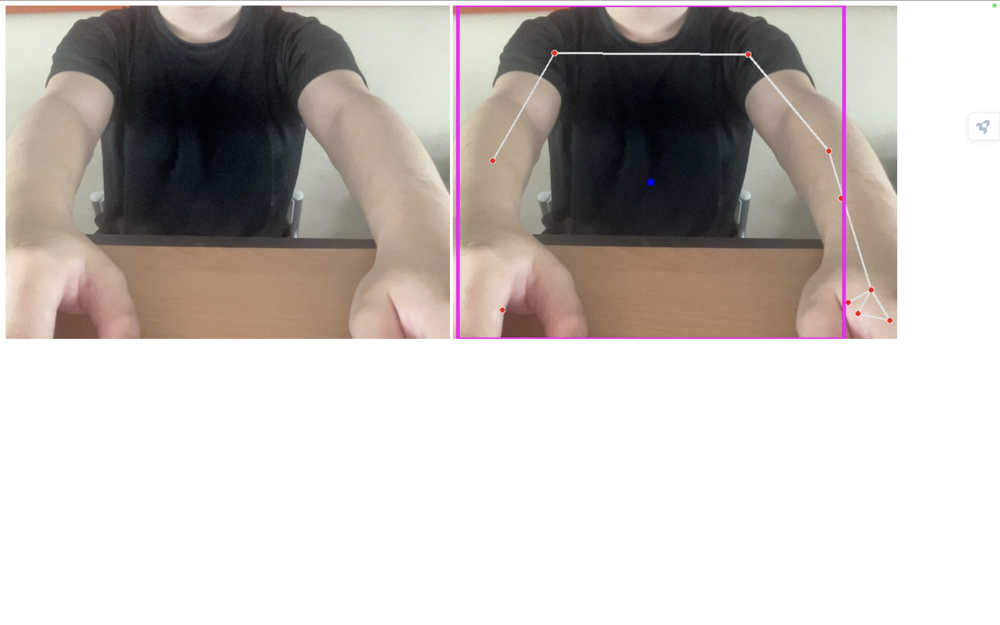

# CVZone을 이용한 실시간 포즈 인식

# 실행 방법

## 서버
서버는 우분투나 윈도우 환경에서 실행해주세요.

가상환경 파이썬 버전: 3.8.19

### 설치해야 할 패키지

Flask\=\=3.0.3,
Flask-Cors\=\=4.0.1,
Flask-SocketIO\=\=5.3.6,
opencv-python\=\=4.10.0.84,
cvzone\=\=1.6.1,
numpy\=\=1.24.4

## 클라이언트
Visual Studio Code에서 Extension으로 Live Server를 설치해 주세요

Live Server link: https://marketplace.visualstudio.com/items?itemName=ritwickdey.LiveServer

client/index.html 파일을 우클릭하여 Open with Live Server 를 클릭해 index.html을 웹에 띄워주세요.